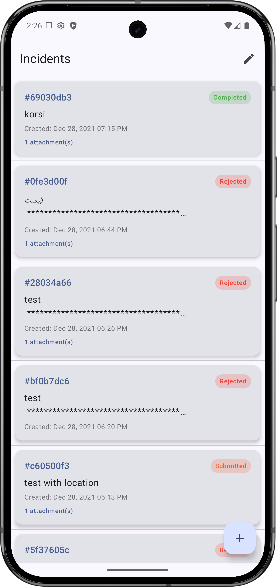
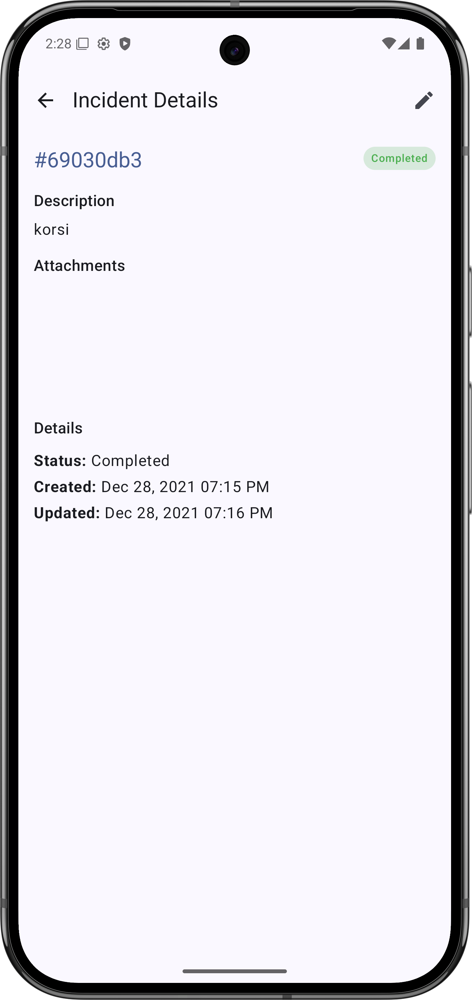
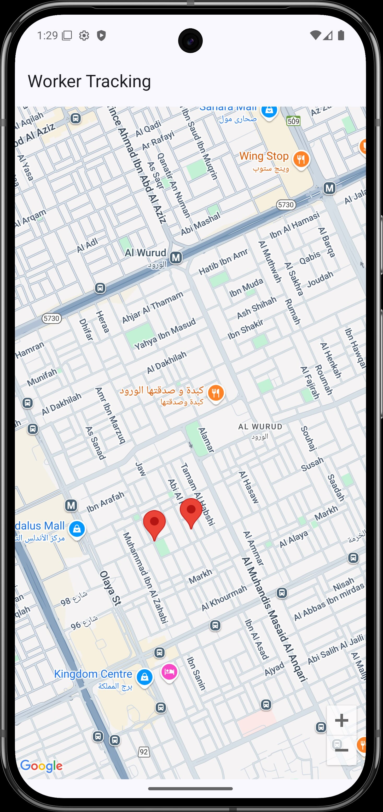

# 🎫 Elm Ticket Tracking - Streamlined Incident Management

**Elm Ticket Tracking** is a modern Android application designed to simplify and enhance the process of managing incidents or tickets. Built using the latest Jetpack Compose UI toolkit and following clean architecture principles, this app provides a user-friendly and efficient way to track, filter, and update the status of incidents.

**Note**
The main focus of this project currently is to show a simple functionality with happy scenarios in most cases, focusing on having a good and scalable architecture that can be a building block to easily extend the app functionality

## ✨ Key Features

*   **Incident Listing:** View a comprehensive list of all incidents with essential details like ID, description, creation date, and status.
*   **Detailed Incident View:** Dive into individual incidents to see full descriptions, attachments, creation/update times, and current status.
*   **Filtering:** Easily filter incidents by status (Submitted, In Progress, Completed, Rejected) and date.
*   **Status Updates:** Update the status of incidents to reflect their current state.
*   **Add New Incidents:** Quickly create new incidents with relevant information.
*   **Image Attachments:** Add images to incidents.
*   **Modern UI:** Enjoy a clean, intuitive, and visually appealing user interface built with Jetpack Compose.
* **Statistics**: Display an overview of the incidents using a Pie Chart.
*   **Tracking using Google Maps:** Implement a feature to track the location of incidents on a map using Google Maps integration.
*   **Unit Tests:** Add comprehensive unit tests to improve code reliability and maintainability.

## 🚧 Upcoming Features (TODOs)

These features are planned for future development:

*   **Comprehensive Documentation:** Enhance the code documentation to provide better clarity and guidance for developers.
* **Attachment Preview**: In the future we should show the attached images of the incident, but now it's out of scope.
* The Project is currently built on Postman mocked data
*  **Some Functionalities are not implemented yet**: like updating the ui after submitting a new incident, etc.

## 🛠️ Tech Stack

This project leverages the following cutting-edge technologies:

*   **Jetpack Compose:** A modern UI toolkit for building native Android UIs with a declarative approach.
*   **Kotlin:** A concise and expressive programming language, fully interoperable with Java.
*   **Hilt:** A dependency injection library that simplifies app development by reducing boilerplate code.
*   **Retrofit:** A type-safe HTTP client for Android and Java, making it easy to connect to RESTful APIs.
* **OkHttp**: Used for managing network operations and interceptors.
*   **Coroutines:** For asynchronous programming and simplifying background tasks.
*   **Flow:** For handling streams of data reactively.
* **ViewModel:** Used to manage the UI data and state.
*   **Clean Architecture:** A robust architecture that separates concerns, enhancing maintainability and testability.
*   **Material 3:** The latest Material Design guidelines for creating a visually appealing and consistent app experience.
* **Coil**: Used to load images asynchronously.

## 📱 Screenshots

## 🚀 Getting Started

Follow these steps to get the project running on your local machine:

1.  **Clone the Repository:**
2.  **Open in Android Studio:**
    *   Launch Android Studio ( the app was built using Android Studio Meerkat | 2024.3.1 Patch 1).
    *   Select "Open an existing Android Studio project."
    *   Navigate to the directory where you cloned the repository and select it.

3. **Google Maps API Key**
    * This project has the feature of tracking incidents on a map using Google Maps.
    * To use Google Maps you need to have a Google Maps API key.
    * Create a Google Cloud project.
    * Enable the Maps SDK for Android API.
    * Create an API key and add restrictions (Android apps)
    * In the root of your project, create a file named `secrets.properties` and add the line `MAPS_API_KEY="YOUR_API_KEY"` (Replace `YOUR_API_KEY` by the real key).
    * The project is designed to read the api key from the `secrets.properties` file.
4.  **Build the Project:**
    *   Once the project is open, allow Gradle to sync.
    *   Go to `Build > Make Project` to build the project.
    *   You might need to  go to `Build > Clean And Assemble Project ` or `Build > Assemble Project` 

5.  **Run the App:**
    *   Connect an Android device or start an emulator.
    *   Click the "Run" button (green play icon) in Android Studio to run the app.

## 🤝 Contributing

I welcome contributions from the community! If you'd like to help improve Elm Ticket Tracking, please follow these steps:

1.  Fork the repository.
2.  Create a new branch (`git checkout -b feature/your-feature-name`).
3.  Make your changes and commit them (`git commit -m "Add some feature"`).
4.  Push to the branch (`git push origin feature/your-feature-name`).
5.  Create a new Pull Request.

## 📄 License

This project is licensed under the [MIT License](https://opensource.org/licenses/MIT).

## 👨‍💻 Author

*   **Ahmed Nabil Mahran** - [ahmednmahran](https://github.com/ahmednmahran)

## 🙏 Acknowledgments

*   The Android Developer community for their support and valuable resources.
* All the amazing open-source libraries used in this project.

---

**Let's make incident management a breeze!**
